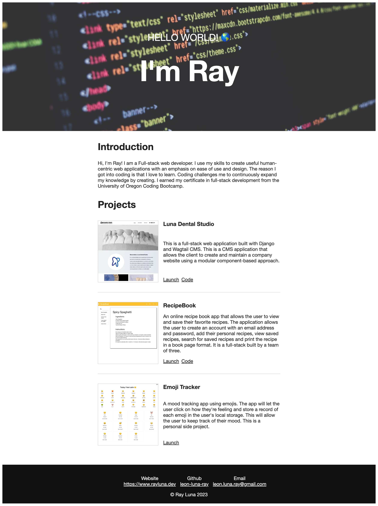

## About Me
This my very first coding project a website about me. It was originally a static HTML site.
It was since refactored it to pull data from Sanity CMS and is hosted on Netlify.

It is a single HTML page with CSS and Vanilla JavaScript.

[https://prework-about-me.netlify.app](https://prework-about-me.netlify.app)

Technologies
- HTML5
- CSS3
- JavaScript ES6
- Vite.js
- Sanity
- Netlify

